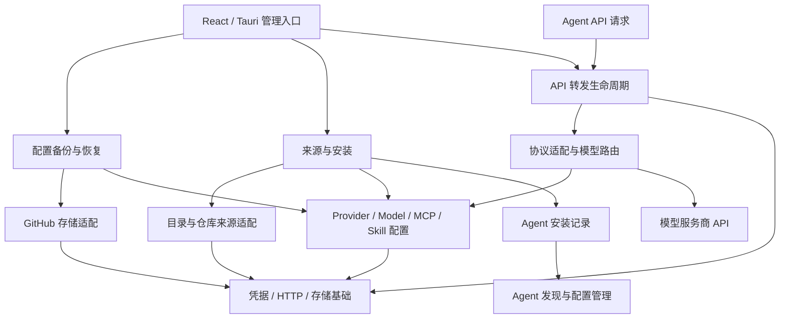

# 后端模块拆分与扩展边界

本文按维护者提出的后续 Vercel、GitHub、更多 MCP 和模型服务商接入需求制定。
维护者进一步明确的用途包括：配置备份到 GitHub、从 MCP/Skill 来源直接安装，
向 Agent 提供 API 转发，以及可能直接安装 Agent。上述用途决定模块边界，而不是按外部品牌归类所有业务。
以 MCP 提交 `165e262` 的源码为基线；记录目标和迁移方式，不表示未来集成已实现。
任务状态只维护在 [todo.md](todo.md) 的 BR 系列任务中。

## 当前判断

现在适合整理后端职责边界，继续保留一个 Rust crate。第一轮优先拆命令入口、
业务混合文件和内联测试，采用小批迁移；每批保持现有行为可运行。
扩展能力用实际业务接入来验证，不提前引入动态插件、统一连接器框架或多 crate workspace。

本轮 BR1–BR4 已实施：八个大文件的内联测试原样迁出，命令分为 app、preferences、providers、models、mcp 与 state。`commands.rs` 从 692 行变成 11 行的模块声明/锁导出入口；功能命令文件为 82–221 行。

Provider 原 1184 行运行时入口拆为 63 行 facade，`providers/` 的 types、templates、validation、repository、service 分别为 370、40、126、382、180 行。MCP 原 770 行入口变为 15 行 facade，对应 types、validation、repository、service 为 212、167、338、131 行。SQL 查询和事务留在 repository；OS 凭据写入、补偿、清理步骤留在 service，提示仍在数据库锁外。

`shared.rs` 为 94 行，仅复用文字校验、32 位小写十六进制 ID 格式与毫秒时间。MCP 使用内部 `McpId`，不再依赖 Provider 类型/错误/校验；ProviderId 保留原公开语义，业务错误分别映射。公开 Provider 时间/显示名入口与 Catalog 的内部 Unicode 校验兼容导出保留。Models/Fetch 等其他职责按 BR5 起的实际需求继续整理。

测试模块路径不变，例如 `providers::tests::unified_save`。Rust 从 `providers.rs` 的 `mod tests;` 查找 `providers/tests.rs`，其子模块继续查找 `providers/tests/unified_save.rs`。测试 fixture 的 `include_bytes!` 路径按新文件位置调整；测试清单与迁移前完全一致。共享的测试 fake 和 TCP fixture 仍保持原有入口。

29 个 Tauri 命令的 wire name 和注册顺序保留，只改变 Rust 注册路径。凭据锁在 `commands/state.rs`，仅在 commands 内部开放字段访问，并保留 root 的类型导出供启动注册；服务商和模型仍采用原来的 poisoning 处理，MCP 仍返回原有安全失败码。没有修改调度、锁顺序、协议、数据格式、前端组件或能力权限。

拆分前基线规模如下；行数包含空行、注释和测试，不作为强制拆分阈值。
“测试前”指文件首个 `#[cfg(test)]` 标记之前，属于粗略规模指标。

| 文件               | 总行数 | 测试前行数 | 拆分前集中职责                                       |
| ------------------ | -----: | ---------: | ---------------------------------------------------- |
| `providers.rs`     |   2235 |       1163 | 品牌/协议/模板、身份、校验、SQL、凭据写入协调        |
| `model_fetch.rs`   |   1739 |        888 | 获取注册与取消、快照、下载、浏览缓存/搜索/分页、合并 |
| `models.rs`        |   1689 |        938 | DTO/错误、游标、列表/搜索、选择与手动模型、SQL       |
| `storage.rs`       |   1050 |        429 | 打开数据库、状态、迁移 SQL 与执行、测试              |
| `model_catalog.rs` |   1005 |        545 | 三家响应解析、端点能力、收集器、OpenRouter 分页      |
| `credentials.rs`   |    973 |        386 | Secret 类型、平台存储、补偿、测试 fake 与测试        |
| `http_client.rs`   |    858 |        367 | HTTP 设置、Bearer GET、响应限制、错误、取消/超时     |
| `mcp.rs`           |    770 |        768 | DTO、校验、元数据查询、凭据协调与清理、SQL           |
| `commands.rs`      |    692 |        692 | 所有功能的 Tauri 命令、状态查找、凭据锁              |

基线 MCP 的测试已独立放在 `mcp/tests.rs`，其他文件有相当比例的内联测试。
本轮既迁出测试，也完成 Provider/MCP 业务职责拆分。

基线中的耦合与本轮处理范围：

- MCP 原使用 `providers::ProviderId` 和服务商文字校验；BR4 已改为独立身份和共享格式/文字校验。
- 时间戳和通用文字校验原属于 providers；BR4 已移至 shared，命令按各业务映射原有错误。
- `model_fetch` 借用 `models::lock`，并直接操作模型 SQL；获取编排与数据访问应分开。
- `ModelError` 同时包含本地编辑、凭据、网络和目录解析错误。可以拆内部职责，
  但第一轮保留现有前端错误码，不能顺便改动 IPC 合约。
- HTTP 客户端的 `get_bounded` 固定 Bearer 认证，HTTP 402 被解释为余额不足，
  403 被归入认证拒绝。它目前服务于模型发现，不能直接当作所有云服务的通用客户端。

## 模块边界

按功能聚合业务，功能内部再分类型、校验、数据访问和操作编排。
`repository` 指本地 SQLite 数据访问；`service` 指完成一次业务操作的步骤协调。
小模块不必同时创建这些文件。只有已有职责值得独立时才拆，避免空目录和样板。

| 边界                               | 负责什么                                                  | 依赖约束                                                       |
| ---------------------------------- | --------------------------------------------------------- | -------------------------------------------------------------- |
| `commands`                         | IPC 参数、Tauri 状态、blocking/async 调度、稳定错误映射   | 业务模块不反向依赖 commands/Tauri                              |
| `providers`                        | 模型服务商实例、协议选择、模板、实例凭据操作              | 不承载 GitHub/Vercel 云服务账号                                |
| `models`                           | 已保存模型、选择、能力和参数、搜索                        | 通过 ProviderId 关联服务商，避免获取层借用私有 SQL helpers     |
| `model_fetch`                      | 模型发现用例、取消生命周期、快照、缓存与持久化合并协调    | 网络请求在数据库锁外；合并再次校验修订                         |
| `model_catalog`                    | 各服务商响应转换、目录收集/分页、已核实能力映射           | 按厂商局部适配，协议相同不等于模型接口相同                     |
| `mcp`                              | 中央 stdio/HTTP 定义、凭据、中央状态                      | 定义保存与显示不执行服务器；部署和连接另设用例                 |
| `storage`                          | 数据库连接生命周期、单一顺序迁移入口                      | 每个功能拥有自己的 SQL；不集中所有 CRUD                        |
| `credentials`                      | 非泄漏 Secret 类型、OS 存储接口与实现                     | 平台层不依赖 Provider/MCP/云服务业务类型                       |
| `http_client`                      | 当前模型发现网络边界；未来按需提取通用 transport          | 认证方式、业务错误和重试由各服务决定                           |
| `shared`                           | 确有多处复用的时间与文字/ID 格式校验                      | 保持小而具体；不成为杂项业务集合                               |
| `agents` / `skills`（未来）        | Agent 适配、Skill 来源与部署                              | Agent 映射独立于 Provider 协议，复用安全写入基础               |
| `integrations`（未来）             | GitHub/Vercel 账号与资源操作                              | 云服务契约独立，按真实需求复用基础设施                         |
| `backup`（未来）                   | 配置快照、备份格式、目标选择、上传与恢复协调              | 调用 GitHub 等存储适配器；不把 OS 密钥和运行状态直接复制到远端 |
| `sources` / `installation`（未来） | Agent/MCP/Skill 来源、固定版本、安装计划、执行与卸载/更新 | 来源内容为数据；安装依赖与 Agent 部署是不同操作                |
| `gateway` / `protocols`（未来）    | 本地 API 服务生命周期、模型路由与协议请求/响应转换        | 调用 Provider/Model 配置；长时间转发不持数据库或凭据写锁       |

模块布局统一使用 Rust 的文件加同名目录方式：`providers.rs` 声明入口和导出，
`providers/types.rs` 等文件实现子模块。规划与实施都不引入 `mod.rs`。
沿用当前 stable Rust 和 edition 2024；模块布局之外，也避免引入弃用 API 或旧版
Tauri 写法。模块内部函数优先私有或 `pub(super)`；跨功能需要的小接口才用
`pub(crate)`，不为了编译到处开放实现细节。
`commands` 使用新的子模块注册路径，Tauri 对外命令名保持原样。
当前部分类型已通过 `pub mod` 暴露，移动时保持公开入口。

一个功能可采用这样的结构，具体文件由迁移批次按需产生：

```text
providers.rs       # 声明子模块与原有公开入口
providers/
  types.rs         # 实例、请求、协议类型和安全错误
  templates.rs     # 支持的品牌及其声明
  validation.rs    # Provider 专用规则
  repository.rs    # SQLite 读写
  service.rs       # 保存及凭据补偿协调
  tests.rs
  tests/
commands.rs        # 声明功能命令与共享状态模块
commands/
  state.rs         # 状态访问和进程内凭据锁
  app.rs
  preferences.rs
  providers.rs
  models.rs
  mcp.rs
```

## 未来接入如何放置

新增模型服务商需要分开验证品牌、协议、认证、模型发现和能力/参数。
已有 Chat Completions 支持不能自动证明新厂商支持。先保留明确的品牌枚举和
能力声明，逐家添加响应适配；确有多个实现重复时再引入小的静态 adapter 接口。
不要提前要求每个厂商实现获取、推理、额度、OAuth 等一整套统一 trait。
现有数据库 CHECK/验证若限制品牌，增加厂商需配套迁移，并保留旧实例和模型。

GitHub/Vercel 按独立云服务客户端规划。GitHub 已明确作为配置备份目标，
Vercel 的首条操作仍待确定：

- 服务连接用自己的 account/connection ID、授权状态和资源类型，不能复用
  ProviderId、ProviderKind 或模型服务商实例表来存云服务账号。
- 共享 OS 凭据底层；凭据引用前缀和 service name 属于存储兼容契约。
  OAuth token/refresh token 生命周期不同于 API key；授权需求明确后再设计
  账号状态、授权 scope、到期/刷新/撤销与系统浏览器回调。
- GitHub 的仓库 API、Skill 来源和 GitHub MCP 是不同用途，可以关联同一个
  明确选定的账号，但不能推定一个用途的授权足够覆盖其他用途。
- Vercel/GitHub MCP 仍是 `mcp` 中央定义，可通过显式映射关联集成账号；
  普通 HTTP MCP URL 不会自动变成云服务账号或启用 OAuth。
- 云服务客户端需要保留分页、权限/资源错误与限流信息；不能直接继承当前
  “403 等于认证拒绝、402 等于余额不足”的模型发现分类。
- 未来 transport 复用连接设置、响应限制和安全错误处理；各业务客户端自行决定
  认证、允许的状态码与重试条件。MCP Streamable HTTP 的会话和流式行为另行实现。

## 明确的新业务边界

### 配置备份到 GitHub

`backup` 拥有版本化备份格式、快照与恢复规则，`integrations/github` 负责远端仓库
文件读写、认证和远端修订信息。未来换成本地文件或其他目标，不重写备份规则。
先做显式备份/恢复，再按需要增加自动备份或同步；这些操作的冲突语义不同。

备份采用受控导出格式，内容包括配置、模型选择、MCP/Skill 定义及其固定来源版本，
而不是直接上传可能正在写入的 SQLite 文件、日志或整个 Agent 配置目录。
默认不含 OS 凭据值；本机凭据引用跨设备不能当作可用授权。恢复时明确哪些凭据
需要重新关联或填写，不自动复制原设备引用后宣称连接可用。
如果以后要求迁移秘密，单独规划加密格式和密钥恢复，不加入普通配置备份。

同一次配置快照保持内部一致；远端更新带修订/冲突检查，只修改选定仓库的受管备份
路径，不覆盖其他文件。恢复先解析版本和校验，再展示配置差异、处理身份冲突并写入。
恢复本地定义不会自动安装 MCP/Skill、执行命令、恢复转发服务或写入 Agent。

### 从 MCP/Skill 来源安装

`sources` 将目录 API、Git 仓库等不同来源转换为可检查的候选信息：来源身份、版本/
revision、资源类型、下载位置与依赖声明。来源接口是否存在以及实际契约，在接入
该来源时核实；不预设所有“提供商”都有相同安装协议。

`installation` 协调候选选择、固定版本、预览、安装、更新、卸载和失败恢复。
MCP 安装得到可用的本地包/执行路径及中央定义；Skill 安装得到受管文件和来源记录。
安装器采用明确的可支持类型，结构化传递可执行文件和参数，不拼接任意脚本 API。
目录展示、定义导入、备份恢复与下载元数据不会顺带执行安装命令。

MCP 的依赖安装、服务器启动/连接、Agent 配置部署各有自己的状态。
Skill 的本地安装、Agent 链接/复制部署同样分开。更新保留用户修改信息；记录受管
路径、固定 revision、安装步骤和结果，供后续重试/卸载使用，不能删除用户未受管文件。
可复用 P19 的安全文件写入和 P34 的操作恢复思路，但 GitHub 备份、软件安装与
Agent 配置备份仍分别保留自己的格式和业务语义。

### 直接安装 Agent

Agent 安装纳入 `installation` 的业务范围，`agents` 保留安装发现、版本/能力检测、
配置优先级和配置应用的职责。不同 Agent 的包管理器、发布包或安装方式，在官方
契约核实后分别实现安装 adapter；共享下载、版本固定、受管安装记录和操作进度，
而不把所有安装方案强行统一成同一条命令。

选择 Agent → 检查现有安装与目标平台/架构 → 展示安装计划 → 执行 → 检测实际版本
与能力，是一条独立安装流程。后续升级和卸载根据受管安装记录处理；用户已有安装
应先识别来源，不把“发现到了”当作“由应用安装并可删除”。Agent 配置与用户工作目录
不属于安装包清理范围。升级可能影响配置能力，重新检测结果后再生成配置差异。

安装完成只表示软件存在，不自动启动 Agent、配置模型或声明推理连接成功。
运行 Agent、写入配置、连接 gateway 均保留明确操作和各自状态。此规划承接 P17
只读发现而不是把发现改成自动安装；新增安装功能实施前独立拆解任务。

### 给 Agent 提供 API 转发

`gateway` 是 Rust 进程内的服务，负责本地监听、启动/停止、连接处理、路由配置
快照和运行状态。React 通过 Tauri 管理它；Agent 直接访问本地 API，转发流量不走
Tauri IPC。配置指向本地端点的 Agent 写入仍由 `agents` 完成。
初期采用明确的本地访问与授权边界；外网监听、云端部署和多用户服务另行规划。

`protocols` 负责已验证的请求/响应和流式事件转换，Provider adapter 负责上游认证、
端点和厂商差异。gateway 通过稳定 Provider/Model 身份路由，不把显示别名当作唯一键。
MCP server 的路由与 LLM API 转发是两套契约，不能因为都是 HTTP 就共享业务接口。

第一条转发路径优先验证同协议，再逐项增加转换。支持矩阵需要覆盖普通与流式响应、
工具调用、错误、客户端取消及其上游取消；推理、图像、参数转换必须按真实协议核实。
不支持的映射显式拒绝，不静默删字段或宣称所有 OpenAI 兼容服务都等价。
限流重试和路由切换需考虑已输出流与重复请求，不能照搬模型发现 GET 的行为。
可复用 TLS/代理/超时等网络基础，但当前返回完整 `Vec<u8>` 的客户端不能作为流式
转发实现。运行时需要快照读取和短期凭据访问，不能在长连接期间占用 SQLite 锁。

依赖关系如下，均表示未来业务设计；当前仍只存在前面列出的现有功能：



## 渐进迁移顺序

1. **独立测试。** 原样迁出大文件内联测试，保留测试 helper 可见性和 fixture 路径，
   核对测试数量与实际执行情况。当前 201 项通过、1 项真实 OS 凭据测试忽略是基线。
2. **命令入口。** 分出状态/锁与各功能命令；保留 handler 名、参数、响应、日志与调度行为。
3. **Providers 与 MCP。** 各自拆 types/validation/repository/service；再抽真正共享的
   文字/时间/ID 格式校验，移除 MCP 对 ProviderId 的语义依赖。
4. **Models 与 Fetch。** 拆本地查询/选择、获取生命周期、下载、浏览缓存和合并入口。
   防止为拆文件改变快照、取消阶段或持有注册令牌的时间。
5. **服务商解析与基础设施。** 局部化目录适配；迁移入口按编号集中注册，已发布 SQL
   内容不重写。OS 存储机制与各业务补偿策略区分开。
6. **新业务驱动扩展。** 分别规划 GitHub 配置备份、MCP/Skill 来源安装和同协议
   API 转发及 Agent 安装首条路径。每条先明确数据与生命周期，再提取实际复用的网络/授权能力。
   Vercel 的用途确定后再增加适配。未来目录只出现在计划中，当前不创建空壳。

前三步已在本轮完成并通过回归。下一步按实际业务需求继续 Agent/MCP 注入或 BR5 整理。
后面按新增服务商或云服务接入的实际需求开展，不要求做完所有整理才能开发业务。

## 回归与边界

每个迁移批次通常控制在 1–5 个实际文件，超出时继续拆任务；单批可以独立提交和撤回。
同一批不同时改 IPC、数据格式、并发规则和目录结构。纯重排不添加重复实现测试，
但必须运行已有测试，真实缺口补针对性测试。

验收需保持：

- 原有 Tauri 命令名、serde 字段/错误码、稳定 ID、凭据 service name/引用与 schema v8。
- 凭据提示不占用 SQLite 锁、获取快照与合并的修订校验、取消阶段与资源释放顺序。
- 已存模型选择、非敏感 MCP 元数据、秘密清理、补偿与未知结果重读行为。
- 正常行为与测试仍可脱离 Tauri 窗口运行；只移动到子目录不等于已经解决依赖。

运行 Rust fmt、Clippy（all targets、零警告）与完整测试；命令/导出/构建资源移动批次
另外跑完整前端检查和锁定原生构建，并按影响做隔离原生 IPC 验证。
现有真实凭据库和多平台待验项继续待验，不以结构重排宣称它们已完成。
